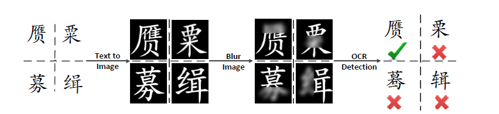
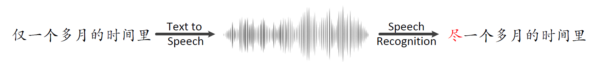

## A Hybrid Approach to Automatic Corpus Generation for Chinese Spelling Checking (EMNLP2018)

This repository contains the scripts which can be used to automatically generate sentences
with errors, of which locations and the corresponding corrections can be easily marked without
any human intervention. A generated **Dataset** containing more than 100,000 sentences, and **Confusionset** are also provided for  future research on Chinese Spelling Cecking. 

**Note:** The **Dataset** and **Confusionset** will be continuously updated.

## Main Libraries
* [pytesseract](https://github.com/madmaze/pytesseract)
* [OpenCV](https://github.com/opencv/opencv)
* [Kaldi](https://github.com/kaldi-asr/kaldi)
* Python 35
* Pytorch 0.4
* numpy
* [BeautifulSoup](https://pypi.org/project/beautifulsoup4/)

## OCR-based Method


## ASR-based Method

## Basic Model
After generating the dataset using our proposed method, you can try any model you wanna on CSC. Here, we implement a pytorch-based bilstm model, in which 
lots of details can be furture optimized.

* For training, use the command line python main_train.py. Training details will be printed on the screen. 

* For test, use the command line python main_test.py. 

**Note**: You can fine-tune the hyper-parameters or add more generated data to imrprove the model performance.


## Confusionset
For a given word, a confusionset refers to a set of words that are visually or phonologically similar with the given word. For example,  哨:宵诮梢捎俏咪尚悄少销消硝赵逍屑吵噹躺稍峭鞘肖. As a "byproduct" of our proposed method, we construct a confusion set for all involved correct characters by collecting all incorrect variants for each correct character, which is widely used in the task of CSC. We also open this confusionset for future research on CSC.

## Testing Datasets

---

SIGHAN Bake-off 2013: http://ir.itc.ntnu.edu.tw/lre/sighan7csc.html 

SIGHAN Bake-off 2014 : http://ir.itc.ntnu.edu.tw/lre/clp14csc.html

SIGHAN Bake-off 2015 : http://ir.itc.ntnu.edu.tw/lre/sighan8csc.html

**Note**: All datasets above are originally written in Traditional Chinese. Considering the fact that our generated  datasets are in Simplified Chinese, we have translated the original datasets into a version of Simplified Chinese, which can be found in the **Data** folder. The tool we use to translate Tranditional Chinese to Simplified Chinese is [OpenCC](https://github.com/BYVoid/OpenCC).

## Citation

If you find the implementation useful, please cite the following paper: 
*A Hybrid Approach to Automatic Corpus Generation for Chinese Spelling Check*
```buildoutcfg
@InProceedings{Reimers:2018:EMNLP,
  author    = {DingminWang, Yan Song, Jing Li, Jialong Han, Haisong Zhang},
  title     = {{A Hybrid Approach to Automatic Corpus Generation for Chinese Spelling Check}},
  booktitle = {Proceedings of the 2018 Conference on Empirical Methods in Natural Language Processing (EMNLP)},
  month     = {11},
  year      = {2018},
  address   = {Brussels, Belgium},
}
```

## Contact
Drop me (Dingmin Wang) an email at wangdimmy (AT) gmail.com if you have any question.

 

 


